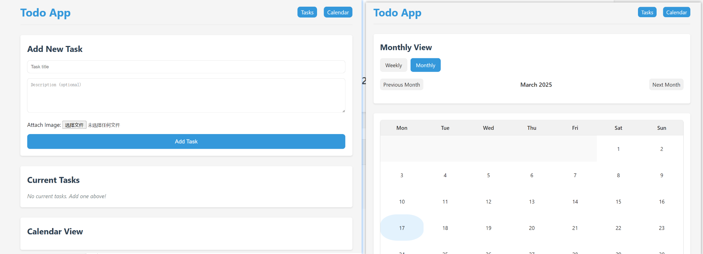

# Todo Web App


### README for Todo Web App

This project is a **Todo Web Application** built using **Python Flask**, **SQLite**, and **HTML/CSS/JS**. It supports organizing tasks into incomplete and completed lists, adding images to todos, managing subtasks, and viewing completed tasks via a calendar interface.

---

## Table of Contents

1. [Features](#features)
2. [Installation](#installation)
3. [Project Structure](#project-structure)
4. [How to Run](#how-to-run)
5. [Screenshots](#screenshots)
6. [Contributing](#contributing)
7. [License](#license)

---

## Features

- **Responsive Design**: Compatible with both mobile and PC.
- **Task Management**:
  - Add, edit, and delete tasks.
  - Insert images into tasks.
  - Expandable subtasks for each task.
- **Task Status**:
  - Incomplete tasks displayed in the main section.
  - Completed tasks displayed at the bottom with detailed views.
- **Calendar View**:
  - Daily, weekly, and monthly views for completed tasks.
  - Blue dot for completed tasks on a date.
  - Red dot for created tasks on a date.
- **Subtask Management**:
  - Add, delete, and view subtasks for both incomplete and completed tasks.
  - Display create time and complete time for each subtask.

---

## Installation

### Prerequisites

- Python 3.x
- Flask (`pip install flask`)
- SQLite (`pip install flask_sqlalchemy`)
- Bootstrap (for responsive design)

### Steps

1. Clone the repository:
   ```bash
   git clone -b Calendar https://github.com/yzmninglang/Todo-web.git
   cd Todo-web
   ```

2. Install dependencies:
   ```bash
   pip install -r requirements.txt
   ```

3. Initialize the database:
   ```bash
   python init_db.py
   ```

---

## Project Structure

```
Todo-web/
├── app.py               # Main Flask application file
├── init_db.py           # Script to initialize SQLite database
├── templates/
│   ├── base.html        # Base HTML template
│   ├── index.html       # Main webpage template
│   ├── calendar.html    # Calendar view template
├── static/
│   ├── css/             # CSS files for styling
│   ├── js/              # JavaScript files for interactivity
│   ├── uploads/         # Directory to store uploaded images
├── models.py            # Database models for tasks and subtasks
├── requirements.txt     # List of Python dependencies
└── README.md            # This file
```

---

## How to Run

1. Init database:
   ```bash
   flask initdb
   ```

2. start Flask
   
   ```bash
   python ./app.py
   ```
   
   
   
2. Open your browser and navigate to:
   
   ```
   http://127.0.0.1:5000/
   ```


---

## Screenshots



---

## Contributing

Feel free to contribute by opening issues or submitting pull requests.

---

## License

This project is licensed under the MIT License. See the [LICENSE](LICENSE) file for details.

---

## Final Notes

Place all files in their respective directories as described in the project structure. Run the app using `python app.py` and access it via your browser. Enjoy managing your tasks efficiently!